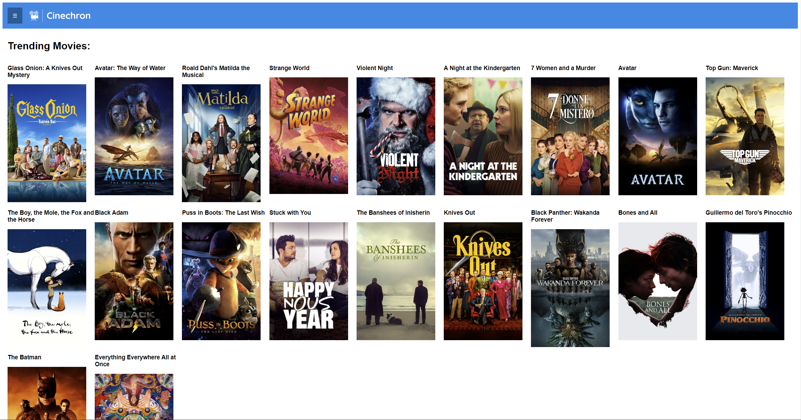
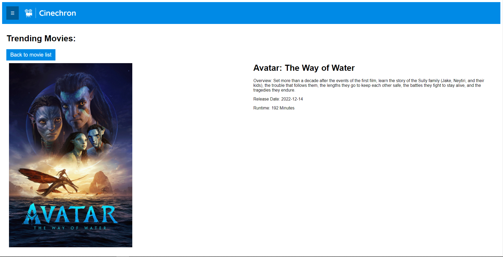
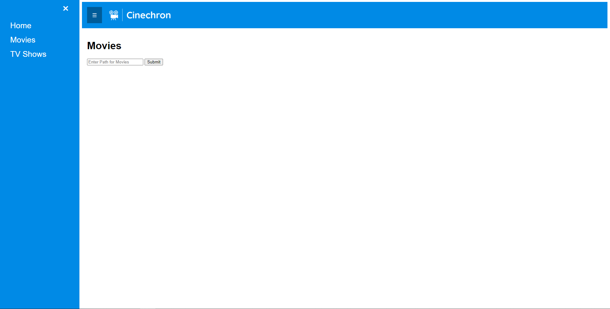
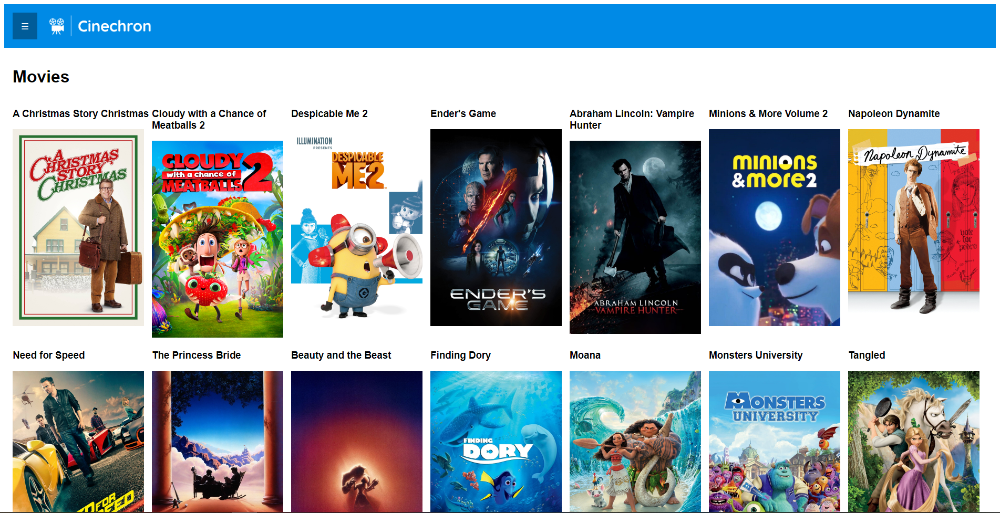

# CineChron
Client-Server project incorporating a personal movie service that uses the TMDB API.

## Usage
The server is started by using the following command:
```
python -m uvicorn main:app --reload
```

The client uses javascript to dynamically generate web pages as well as send data between the client and server.

The homepage shows currently trending movies.



Any movie can be clicked on to view more details



To browse your own personal media collection, open the side menu and select either Movies or TV Shows.

Then enter the path containing your media. Your own movies or TV shows will appear.



More details can be viewed by selecting any movie.

